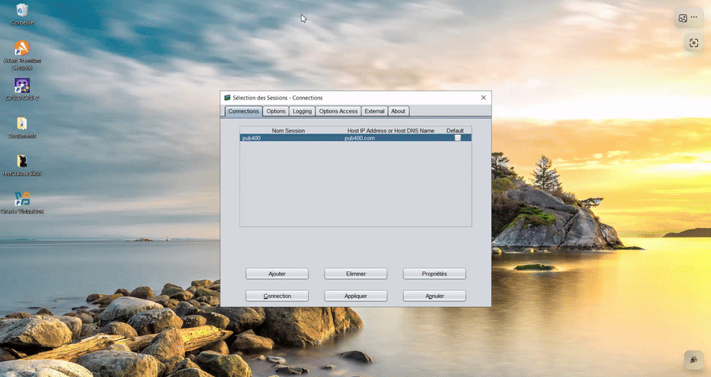

# OculiX Mainframe Demo

**Automatisation d'un mainframe IBM (écrans 5250 / 3270) en Java pur, ~170 lignes, sans DOM, sans API, sans hook côté host.**

[](LICENSE) [](https://adoptium.net/) [](https://github.com/oculix-org/Oculix) [](demo_pub400_run.mkv)

---

## En 30 secondes (pour décideurs)

**Le problème.** Les applications mainframe (zOS en 3270, IBM i / AS-400 en 5250) portent des processus critiques mais restent quasi intestables automatiquement : pas de DOM, pas d'API moderne, et les outils spécialisés du marché (Eggplant, etc.) sont coûteux et lourds à déployer.

**Ce que montre cette démo.** OculiX pilote un mainframe via ce que l'émulateur affiche à l'écran, exactement comme le ferait un opérateur humain : détection visuelle, saisie clavier, vérification du résultat. Login complet automatisé en ~11 secondes, preuve vidéo incluse dans ce repo.

**Non intrusif par construction.** Zéro modification côté host, zéro agent installé sur le mainframe, zéro connexion directe aux données. OculiX n'interagit qu'avec l'émulateur de terminal, côté poste client. Les mots de passe sont exclus des logs. Pour un POC, l'usage d'un compte de test sans données sensibles suffit.

**Agnostique au protocole et à l'émulateur.** La démo utilise le 5250 (IBM i) via tn5250j, mais l'approche est identique en 3270 (zOS, TPX) avec Vista 3270, x3270 ou tout autre émulateur : OculiX ne dépend que de l'affichage, pas du protocole.

**Démarrage.** Un POC sur votre environnement se monte avec trois éléments : le launcher de votre émulateur, un compte de test, et quelques captures d'écran de vos écrans cibles. Intégrable ensuite dans un pipeline Jenkins/GitLab, avec audit trail complet.

---

## Preuve visuelle

[](demo.gif)

Version vidéo haute qualité : [demo_pub400_run.mp4](demo_pub400_run.mp4) (1.2 MB, 11s) — ou en MKV : [demo_pub400_run.mkv](demo_pub400_run.mkv)

## Ce que fait la démo

Se connecte à un serveur public IBM i (PUB400.com) via l'émulateur tn5250j, tape username + password, valide la connexion — le tout piloté uniquement par ce que le système affiche à l'écran.

1. Lance tn5250j
2. Détecte le bouton *Connection* par pixel matching (OpenCV Finder)
3. Attend l'apparition de la bannière PUB400
4. Saisit username + TAB + password + ENTER
5. Détecte l'écran *IBM i Main Menu* qui prouve le login
6. Enregistre une vidéo MKV de la séquence (via ffmpeg, optionnel)

**Compliance-safe** : le password est tapé avec `Settings.ActionLogs = false` autour du `type()`, aucune trace en clair dans les logs.

## Timing mesuré

Timing end-to-end mesuré dans la vidéo (ffmpeg démarre après le startup JVM invisible) :

| # | Étape                         | Début vidéo | Durée | Ce qu'on voit                             |
|---|-------------------------------|-------------|-------|-------------------------------------------|
| 1 | `s.click(CONNECTION_IMG)`     | 00:00.00    | 1.9s  | Clic sur le bouton Connection             |
| 2 | `s.wait(WELCOME_IMG)`         | 00:01.86    | 5.1s  | Session PUB400 s'ouvre, bannière apparaît |
| 3 | `s.type(user)`                | 00:06.99    | 0.9s  | Username qui se tape lettre par lettre    |
| 4 | `s.type(TAB)`                 | 00:07.89    | 0.1s  | Focus passe au champ password             |
| 5 | `s.type(password)` [32 chars] | 00:07.97    | 2.6s  | Password (dots), logs silenced            |
| 6 | `s.type(ENTER)`               | 00:10.56    | 0.1s  | ENTER pour valider                        |
| 7 | `s.observe(LOGGED_IN_IMG)`    | 00:10.64    | 0.5s  | IBM i Main Menu détecté = login prouvé    |

**Total vidéo : ~11 secondes.** L'étape #2 dépend de la latence réseau vers PUB400 (serveur public) ; sur un mainframe accessible en LAN interne, elle serait nettement plus courte — estimation, non mesurée.

## Comment ça marche techniquement

- **Pixel matching** via `Screen.click(image)` et `Screen.wait(image)` — utilise OpenCV Finder en interne, ~50ms par scan grâce au mécanisme d'auto-apprentissage OculiX (le PNG stocke ses coordonnées dans un chunk custom `oPLx`, le prochain match cherche directement à la position mémorisée).
- **Détection post-login via `observe`** — `Screen.onAppear(image) + Screen.observe(5)` retourne `true` dès que l'image `mainmenu.png` apparaît. Zéro sleep aveugle, la preuve visuelle est la preuve du succès.
- **Compliance-aware** — le password est tapé avec `Settings.ActionLogs = false` autour, `try/finally` restaure les logs après (aucune trace dans les logs applicatifs).
- **Aucune dépendance externe** au JAR `oculixapi-4.0.0-windows.jar` (~50 MB, contient OpenCV + Tesseract + Leptonica natives cross-platform embarqués).

## Reproduire la démo

### Prérequis

| Composant                                                            | Où l'obtenir                                                                                                 |
|----------------------------------------------------------------------|--------------------------------------------------------------------------------------------------------------|
| **Java 17 ou plus**                                                  | <https://adoptium.net/>                                                                                      |
| **tn5250j** (émulateur Java open-source)                             | <https://tn5250j.sourceforge.net/>                                                                           |
| **OculiX API 4.0.0** (jar avec natives OpenCV + Tesseract embarqués) | [Direct download](https://github.com/oculix-org/Oculix/releases/download/v4.0.0/oculixapi-4.0.0-windows.jar) |
| **Compte PUB400 gratuit** (facultatif — pour la démo end-to-end)     | <https://pub400.com>                                                                                         |
| **ffmpeg** (facultatif — pour la vidéo)                              | <https://ffmpeg.org/download.html>                                                                           |

### Installation

```bash
git clone https://github.com/julienmerconsulting/oculix-mainframe-demo.git
cd oculix-mainframe-demo

# Télécharger le jar OculiX API 4.0.0 dans le dossier courant
curl -L -o oculixapi-4.0.0-windows.jar \
  https://github.com/oculix-org/Oculix/releases/download/v4.0.0/oculixapi-4.0.0-windows.jar
```

### Configuration

Définir 3 variables d'environnement avant d'exécuter :

```bash
# Windows PowerShell
$env:TN5250J_BAT     = "C:\path\to\tn5250j\tn5250j.bat"
$env:PUB400_USER     = "YOUR_PUB400_USERNAME"
$env:PUB400_PASSWORD = "YOUR_PUB400_PASSWORD"

# Linux / macOS bash
export TN5250J_BAT="/path/to/tn5250j.sh"
export PUB400_USER="YOUR_PUB400_USERNAME"
export PUB400_PASSWORD="YOUR_PUB400_PASSWORD"
```

### Compile & Run

```bash
# Compile
javac -cp "oculixapi-4.0.0-windows.jar" DemoOculixMainframe.java

# Run (Windows)
java -cp ".;oculixapi-4.0.0-windows.jar" DemoOculixMainframe

# Run (Linux / macOS)
java -cp ".:oculixapi-4.0.0-windows.jar" DemoOculixMainframe
```

La vidéo `demo_pub400_run.mkv` est créée à la racine si `ffmpeg` est dans le `PATH`. Sinon le script s'exécute sans enregistrement, en affichant `ffmpeg introuvable dans PATH — recording skippé`.

### Sortie attendue

```
[TIMING] Screen init (JVM + OpenCV + Legerix load) | step=  2825 ms | total=  2825 ms
[TIMING] App.open(tn5250j)                         | step=  3588 ms | total=  6413 ms
[TIMING] sleep 2000ms (laisse tn5250j apparaître)  | step=  2013 ms | total=  8426 ms
[TIMING] ffmpeg recording started                  | step=    22 ms | total=  8448 ms
[TIMING] s.click(CONNECTION_IMG)                   | step=  1859 ms | total= 10307 ms
[TIMING] s.wait(WELCOME_IMG) matched at L[416,73]  | step=  5137 ms | total= 15444 ms
[TIMING] s.type(user) [9 chars]                    | step=   893 ms | total= 16337 ms
[TIMING] s.type(TAB)                               | step=    86 ms | total= 16423 ms
[TIMING] s.type(password) [32 chars, silenced]     | step=  2586 ms | total= 19009 ms
[TIMING] s.type(ENTER)                             | step=    83 ms | total= 19092 ms
[TIMING] Login confirmé (observe → IBM i Main Menu détecté) | step=   483 ms | total= 19575 ms
[TIMING] ffmpeg recording stopped + finalized      | step=   133 ms | total= 19708 ms

[TIMING] === TOTAL === 19708 ms (19.71 s)
```

### Assets

| Fichier                       | Rôle                                          |
|-------------------------------|-----------------------------------------------|
| `assets/AS400_Connection.png` | Bouton *Connection* du launcher tn5250j       |
| `assets/welcompub.png`        | Bannière "Welcome to PUB400.COM"              |
| `assets/mainmenu.png`         | Signature *IBM i Main Menu* (preuve du login) |

Ces PNG contiennent chacun leurs coordonnées de dernière position dans un chunk custom OculiX, ce qui rend les runs successifs quasi instantanés sur le pattern matching (~10-50ms par lookup).

## Adapter à votre environnement

Ce POC utilise **PUB400.com** (serveur IBM i public gratuit) comme cible de démonstration. Le même code s'adapte à tout environnement mainframe réel :

**Sur IBM i / AS-400 (5250)** — le protocole est identique sur tous les IBM i déployés en banque, assurance, industrie. Il suffit de :

- pointer `TN5250J_BAT` vers votre launcher local ;
- remplacer `PUB400_USER` / `PUB400_PASSWORD` par un compte de test interne ;
- regénérer les 3 PNG depuis votre écran cible.

**Sur zOS (3270)** — même principe avec votre émulateur 3270 (Vista 3270, x3270, IBM PCOMM...) : OculiX pilote ce que l'émulateur affiche, indépendamment du protocole. Seuls le launcher et les captures d'écran changent.

Dans les deux cas : exécution on-premise, intégrable dans un pipeline Jenkins/GitLab, audit trail complet. Pour un POC en environnement bancaire, prévoir un compte de test sans données sensibles — l'automatisation visuelle capture ce que l'écran affiche.

Le framework OculiX sous-jacent est open-source : <https://github.com/oculix-org/Oculix>. Ce POC lui-même n'est pas librement réutilisable — voir la section License.

## License

**Propriétaire — Tous droits réservés.** Voir [LICENSE](LICENSE).

Ce code source est publié à des fins d'**évaluation uniquement** (cloner et exécuter localement pour vérifier ce que ça fait). Toute réutilisation, adaptation, redistribution, ou usage en production nécessite mon autorisation écrite préalable. Contact : [LinkedIn](https://www.linkedin.com/in/julienmer/).

Sur le framework sous-jacent : <https://github.com/oculix-org/Oculix>
